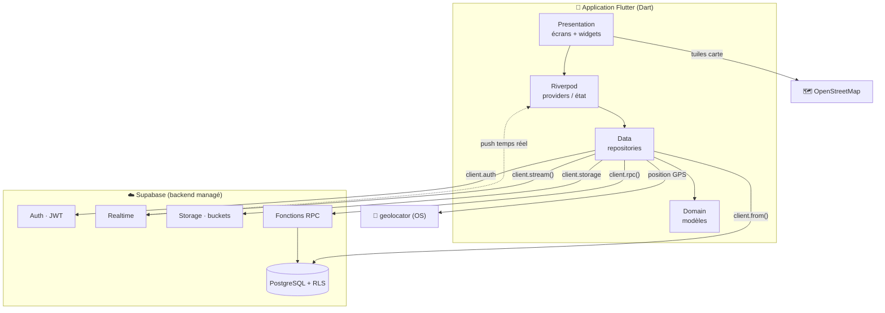
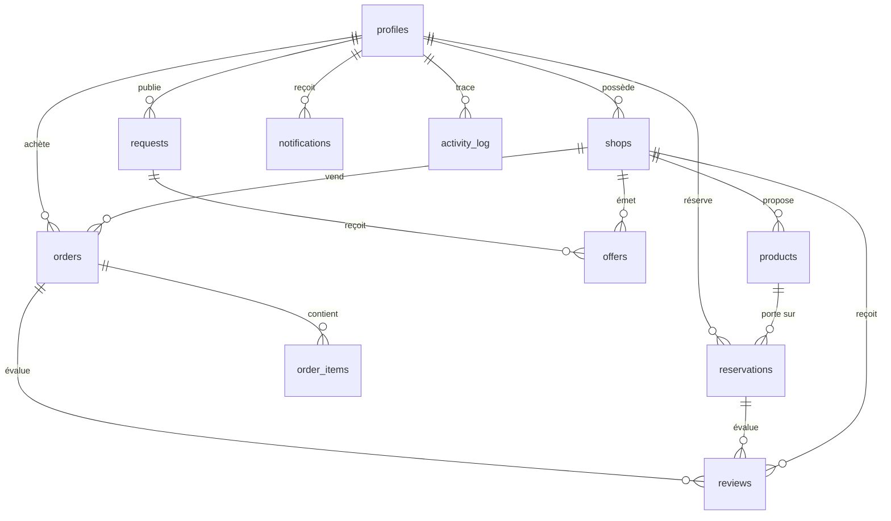

# 🛒 Dioula Market

> **Projet de fin de module Flutter** — Encadreur : **Mr Youssouf TARPILGA**

**Dioula Market** est une application mobile de **marché local en temps réel** pour
la Côte d'Ivoire 🇨🇮. Elle relie **consommateurs, commerçants, producteurs et
livreurs** : on y publie un besoin, les vendeurs répondent, on réserve ou on
commande, un livreur prend la course, et chacun se note à la fin.

L'app est pensée pour une **démonstration de soutenance** : le paiement, la 2FA par
SMS et la vérification d'identité sont **simulés** (aucun service payant requis).

---

## ✨ Fonctionnalités

- **Comptes & rôles** : inscription/connexion, 5 rôles (consommateur, commerçant,
  producteur, livreur, admin) + **mode visiteur** (exploration sans compte).
- **Sécurité** : **2FA** (code à usage unique **simulé**, affiché à l'écran) à chaque
  connexion ; **vérification d'identité** (KYC/CNI) **simulée** avec dépôt de pièces.
- **Boutiques & produits** : création de boutique (logo, **bannière**, description),
  gestion des produits (stock, **prix promo anti-gaspillage**, **vente en gros / en
  détail**).
- **Catalogue** : accueil vitrine, recherche, fiche produit, fiche boutique. Les
  articles des **vendeurs proches** sont mis en avant (**priorité proximité**), et le
  flux s'**actualise** pour voir d'autres articles.
- **Demande instantanée** (cœur de l'app) : un consommateur publie un besoin ; les
  vendeurs font des **offres** en **temps réel** ; le client accepte ou **négocie**
  (contre-offre).
- **Réservation** d'un produit avec **acompte** (simulé) et créneau de retrait.
- **Commandes & livraison** : **pool de livreurs** (un livreur prend une course), et
  **suivi de colis étape par étape** en temps réel.
- **Notation croisée** : après un achat, l'acheteur note la boutique et le vendeur
  note l'acheteur (étoiles + **commentaire** optionnel).
- **Tableau de bord** commerçant (statistiques, diagrammes) + **historique** des
  actions (journal d'audit).
- **Back-office admin** : supervision (stats globales), modération (comptes,
  boutiques, produits, avis), validation KYC, annonces et audit.
- **Notifications** in-app en temps réel, **carte** de proximité, **thème clair/sombre**.

---

## 🧱 Stack technique

> Chaque terme est défini simplement (2–3 phrases) sous le tableau.

| Couche | Choix |
|--------|-------|
| Langage / UI | **Flutter** (Dart 3) — Material 3 |
| Gestion d'état | **Riverpod** |
| Navigation | **go_router** |
| Backend | **Supabase** (PostgreSQL, Auth, Storage, Realtime) |
| Carte / GPS | **flutter_map** (OpenStreetMap) + **geolocator** |
| Graphiques | **fl_chart** |
| Animations | **flutter_animate** |
| Images | **image_picker** + **cached_network_image** |
| Icône de l'app | **flutter_launcher_icons** |

**Flutter** — Cadre de développement de Google pour créer des applications (Android,
iOS, web) à partir d'**un seul code**. Toute l'interface de Dioula Market est écrite
en Flutter.

**Dart** — Le langage de programmation utilisé par Flutter. Il compile en code natif
rapide sur mobile.

**Riverpod** — Une bibliothèque de **gestion d'état** : elle partage des données
(profil connecté, panier d'offres…) entre les écrans et met l'interface à jour
automatiquement quand ces données changent.

**go_router** — La bibliothèque de **navigation** : elle associe chaque écran à une
URL (`/login`, `/shop/view`…) et gère les redirections (ex. non connecté → écran de
connexion).

**Supabase** — Une plateforme **backend** clé en main (alternative open-source à
Firebase). Elle fournit la base de données, l'authentification, le stockage de
fichiers et le temps réel — sans serveur à coder nous-mêmes.

**PostgreSQL** — Le moteur de **base de données** relationnelle (tables, colonnes)
utilisé par Supabase. Nos scripts `supabase/*.sql` sont écrits pour PostgreSQL.

**RLS (Row Level Security)** — Des **règles de sécurité** au niveau de chaque ligne
de la base : elles décident qui peut lire/écrire quoi. Exemple : un acheteur ne voit
que **ses** réservations.

**Realtime (temps réel)** — La capacité de recevoir les changements de la base
**instantanément**, sans rafraîchir. Exemple : une nouvelle offre apparaît toute
seule sur la demande du client.

**Storage / bucket** — L'espace de **stockage de fichiers** de Supabase (images). Un
« bucket » est un dossier de haut niveau ; ici `avatars` et `shop-images` sont
publics, `kyc-docs` est privé.

**RPC (fonction SQL appelable)** — Une **procédure stockée** dans la base, appelée
depuis l'app (`supabase.rpc('accept_offer', …)`). Elle exécute une logique côté
serveur de façon fiable (ex. accepter une offre de manière atomique).

**2FA / OTP** — **Authentification à deux facteurs** : une 2ᵉ preuve d'identité via un
**code à usage unique** (OTP). Ici l'envoi SMS est **simulé** et le code est affiché à
l'écran pour la démo.

**flutter_map / OpenStreetMap** — `flutter_map` affiche une **carte interactive** à
partir des tuiles **OpenStreetMap**, une carte du monde libre et gratuite (sans clé
API).

**geolocator** — Le plugin qui lit la **position GPS réelle** de l'appareil (avec
gestion des autorisations), pour trier les boutiques par distance.

**fl_chart** — Une bibliothèque de **graphiques** (camemberts, barres) utilisée dans
le tableau de bord commerçant.

**flutter_animate** — Une bibliothèque d'**animations** en chaîne (fondu, glissement…)
pour rendre l'interface vivante sans gérer les détails à la main.

**image_picker** — Le plugin qui ouvre la **galerie/l'appareil photo** pour choisir
une image (photo de profil, bannière, pièce KYC).

**cached_network_image** — Affiche une **image distante** avec cache et image de repli
si le chargement échoue (utilisé pour les avatars et couvertures).

**flutter_launcher_icons** — Un outil qui **génère l'icône de l'app** dans toutes les
tailles (Android/iOS/web) à partir d'un seul logo.

**.env (variables d'environnement)** — Un fichier de **réglages secrets** (URL et clé
Supabase) **non versionné**, chargé au démarrage par `flutter_dotenv`.

---

## 📱 Les pages les plus pertinentes

- **Accueil** (`home_feed_page.dart`) — La vitrine : en-tête, recherche, services,
  carrousel promo, filtre **gros/détail**, sections « En vedette » (triées par
  **proximité**), « Près de vous », « Producteurs », « Meilleures notes » et
  « Demandes en cours ». Tirer vers le bas **actualise** le flux.
- **Fiche boutique** (`shop_detail_screen.dart`) — La boutique vue par un client :
  bannière de couverture, note, produits (grille), et section **« Avis &
  commentaires »**.
- **Ma boutique** (`my_shop_screen.dart`) — L'espace vendeur : voir sa boutique en
  **vue client**, gérer ses produits, ses réservations reçues, éditer la boutique.
- **Demande & offres** (`request_detail_screen.dart`) — Le client suit les offres en
  **temps réel**, accepte ou **négocie** (contre-offre) ; le vendeur propose son prix.
- **Réservation** (`reserve_screen.dart`) — Quantité, créneau et **acompte** (30 %,
  paiement simulé).
- **Suivi de commande** (`order_tracking_screen.dart`) — La **feuille de route** du
  colis, mise à jour en temps réel (le livreur avance les étapes).
- **Carte de proximité** (`nearby_map_screen.dart`) — Carte OpenStreetMap avec les
  boutiques proches, triées par distance.
- **Tableau de bord** (`seller_dashboard_screen.dart`) — Statistiques et **diagrammes**
  de la boutique + accès à l'historique.
- **Profil** (`profile_page.dart` / `profile_edit_screen.dart`) — Infos, note, photo
  de profil (upload), vérification d'identité, thème, déconnexion.
- **2FA** (`otp_screen.dart`) — Saisie du code à usage unique (affiché pour la démo).

---

## 🗂️ Architecture (feature-first)

Le code est organisé **par fonctionnalité** (et non par type de fichier). Chaque
dossier de `lib/features/<feature>/` contient :

- `domain/` — les **modèles** (classes Dart : `Product`, `Order`…) ;
- `data/` — l'**accès aux données** (repositories Supabase, providers) ;
- `presentation/` — les **écrans**, widgets et providers d'UI.

Le socle commun est dans `lib/core/` (thème, routeur, widgets réutilisables,
constantes). La cartographie détaillée des fichiers est dans `notion.md`.

### Schéma d'architecture


### Schéma de la base de données (principales tables)

> Une commande (`orders`) référence aussi le **livreur** (`courier_id → profiles`).
> Les diagrammes s'affichent sur GitHub ; dans VS Code, installer l'extension
> *Markdown Preview Mermaid Support*.

### Rôles utilisateurs & interface admin
On distingue 5 rôles (`UserRole`) : **consommateur, commerçant, producteur,
livreur, admin**. Les quatre premiers sont choisissables à l'inscription et ont
leurs propres écrans.

Le rôle **admin** dispose d'un **back-office complet** (compte de démo
`admin@demo.ci`), avec deux onglets dédiés :
- **Supervision** — un tableau de bord global : utilisateurs par rôle, boutiques,
  produits, commandes par statut, **GMV** (chiffre d'affaires livré), réservations,
  avec des graphiques (camembert, barres) et une alerte des KYC en attente.
- **Modération** — les outils du back-office :
  - **Utilisateurs** : bannir / réactiver un compte (le bannissement suspend aussi
    ses boutiques et déconnecte la personne, avec un motif) ;
  - **Boutiques / Produits** : suspendre ou masquer du catalogue ;
  - **Vérifications (KYC)** : consulter les pièces (URL signée) et approuver /
    refuser une identité ;
  - **Avis** : masquer un avis inapproprié (retiré des fiches et exclu de la note) ;
  - **Annonce** : envoyer une notification à tous les utilisateurs ;
  - **Audit** : le journal global des actions de la plateforme.

Côté sécurité, chaque action d'administration passe par une **fonction SQL
`security definer`** gardée par `is_admin()` : un non-admin est refusé côté serveur,
quoi qu'il tente. Chaque action notifie la personne concernée et est tracée dans le
**journal d'audit**.

---

## 🚀 Installation & lancement

### 1. Prérequis
- **Flutter SDK** (Dart ≥ 3.8) — `flutter doctor` doit être au vert.
- Un projet **Supabase** (gratuit) sur [supabase.com](https://supabase.com).

### 2. Dépendances
```bash
flutter pub get
```

### 3. Configuration Supabase (`.env`)
Copier `.env.example` en `.env` à la racine, puis renseigner les 2 valeurs
(*Project Settings → API* dans Supabase) :
```
SUPABASE_URL=https://xxxx.supabase.co
SUPABASE_ANON_KEY=eyJhbGciOi...
```
> La clé **`service_role` ne doit jamais** être mise dans l'app. `.env` est ignoré
> par git.

### 4. Base de données (SQL Editor de Supabase, dans l'ordre)
```
schema.sql → rls.sql → seed.sql → step5_requests.sql → step6.sql → step8.sql →
step10.sql → step11.sql → step12.sql → step13.sql → step14.sql → step15.sql →
step16.sql → step17.sql → step18.sql → step19.sql → step20.sql → step21.sql →
step22.sql → step23.sql → step24.sql
```
Tous les scripts sont **ré-exécutables** (idempotents). Ils créent aussi les
**buckets Storage** nécessaires (KYC, avatars, images de boutique).

### 5. Lancer
```bash
flutter run -d chrome     # test rapide sur le web
# ou : flutter run        # sur un émulateur / appareil Android
```
> Certaines fonctions natives (choix d'image, **GPS réel**) sont meilleures sur un
> **appareil/émulateur** que sur le web.

### 6. Lancer depuis **Android Studio**
1. Installer **Android Studio** + le **plugin Flutter** (et Dart) : *Settings →
   Plugins → « Flutter »* (il installe Dart automatiquement).
2. **Ouvrir** le dossier du projet : *File → Open…* → sélectionner
   `projet_final/`.
3. Vérifier le SDK Flutter : *Settings → Languages & Frameworks → Flutter* (chemin
   du SDK). Lancer `flutter doctor` si besoin.
4. Créer le fichier **`.env`** (copie de `.env.example`) — sinon l'app démarre en
   « mode démo » sans backend.
5. Récupérer les dépendances : bouton **« Pub get »** (bandeau en haut) ou terminal
   `flutter pub get`.
6. Préparer un **appareil** :
   - **Émulateur** : *Tools → Device Manager → Create Device* → choisir un téléphone
     + une image système (Android récent) → démarrer l'émulateur ; **ou**
   - **Téléphone réel** : activer *Options développeur* + *Débogage USB*, brancher en
     USB.
7. Sélectionner l'appareil dans la **barre du haut**, puis cliquer **Run ▶**
   (ou `Shift+F10`).
> La **1ʳᵉ compilation Android** est plus longue (Gradle télécharge des dépendances).
> Autoriser la **localisation** quand l'app la demande (carte / proximité).

---

## 👤 Comptes de démonstration

Mot de passe commun : **`demo1234`** (données créées par `seed.sql`, compte admin
par `step22.sql`).

| Email | Rôle | Lieu / boutique |
|-------|------|-----------------|
| `samira@demo.ci` | Consommatrice | Cocody |
| `raoul@demo.ci` | Commerçant | « Chez Brou », Adjamé |
| `jacob@demo.ci` | Producteur | « Ferme Kouamé », Agboville |
| `kader@demo.ci` | Livreur | Yopougon |
| `anais@demo.ci` | Commerçante | « Maquis Fatim », Treichville |
| `admin@demo.ci` | Admin (supervision & modération) | Plateau |

> À la connexion, l'écran **2FA** s'affiche : le code est visible à l'écran (SMS
> simulé) — il suffit de le saisir.

---

## 🎭 Ce qui est simulé (démo)

- **Paiement** (acompte de réservation) : faux écran de paiement, aucune transaction.
- **2FA par SMS** : le code n'est pas envoyé, il est **affiché** à l'écran.
- **Vérification d'identité (KYC/CNI)** : dépôt de pièces + validation **simulée**.

Ces éléments sont volontairement simulés pour garder la démo simple et gratuite ; les
branchements réels (fournisseur SMS, mobile money, revue KYC) viendraient ensuite.

---

## 🔐 Sécurité & double authentification (2FA)

La sécurité repose sur **plusieurs couches** :

1. **Authentification Supabase** — l'email/mot de passe est vérifié par Supabase Auth
   (mots de passe **hachés**, jamais stockés en clair). En cas de succès, l'app reçoit
   une **session** = un jeton **JWT** signé (avec un *refresh token* pour rester
   connecté).
2. **2FA (2ᵉ facteur)** — une étape supplémentaire **après** le mot de passe.
3. **RLS (Row Level Security)** — la vraie protection des **données** : chaque requête
   est filtrée en base selon l'utilisateur (un acheteur ne lit que **ses** commandes).
4. **Secrets** — seule la clé **anon** (publique, protégée par les RLS) est dans
   `.env` (non commité) ; la clé `service_role` n'est **jamais** dans l'app.

**Comment marche concrètement la 2FA (ici simulée) :**

- À la connexion, `AuthController.signIn` ([auth_controller.dart](lib/features/auth/presentation/auth_controller.dart)) authentifie l'utilisateur puis met le drapeau `otpPendingProvider` à **vrai** (pour **toute** connexion).
- `OtpController.generate()` ([otp_controller.dart](lib/features/auth/presentation/otp_controller.dart)) tire un **code aléatoire à 6 chiffres** et l'« envoie ». Ici l'envoi SMS est **simulé** : le code est **affiché à l'écran** (et loggé). En production, c'est ici qu'un vrai fournisseur SMS (Twilio, Orange SMS…) enverrait le code.
- Tant que `otpPending` est vrai, le **routeur** ([app_router.dart](lib/core/router/app_router.dart)) **force** l'écran `/otp` : impossible d'atteindre l'accueil sans valider.
- Sur [otp_screen.dart](lib/features/auth/presentation/otp_screen.dart), l'utilisateur saisit le code ; `OtpController.verify(input)` le compare. Si c'est bon → `otpPending = false` → écran de succès → accueil. Annuler la 2FA = se déconnecter.

> **Pourquoi simulée ?** Pour une démo d'école, on évite un fournisseur SMS payant tout
> en démontrant **le mécanisme** (un 2ᵉ facteur qui bloque l'accès tant qu'il n'est pas
> validé). Le branchement d'un vrai SMS ne changerait que l'étape « envoi ».

---

## 🗄️ Supabase dans ce projet

**À quoi il sert (usage concret) :**

| Service Supabase | Utilisation dans Dioula Market |
|------------------|--------------------------------|
| **Auth** | Inscription / connexion email+mot de passe, session JWT (`client.auth`). |
| **Base PostgreSQL** | Toutes les tables (profils, boutiques, produits, demandes, offres, réservations, commandes, avis, notifications, journal). Lues/écrites via `client.from('table')`. |
| **RLS** | Règles de sécurité par table ([rls.sql](supabase/rls.sql)). |
| **Realtime** | Flux temps réel via `.stream(primaryKey: ['id'])` (offres, notifications, suivi de livraison). |
| **Storage** | Buckets d'images : `avatars`, `shop-images` (publics), `kyc-docs` (privé). |
| **Fonctions (RPC)** | Logique métier atomique côté serveur (`client.rpc('accept_offer', …)`, etc.). |

**Pourquoi Supabase :**
- **Pas de backend à coder/héberger** → on se concentre sur l'app Flutter (temps limité).
- **PostgreSQL** = une vraie base relationnelle (contraintes, jointures, triggers), pas un jouet.
- **Auth + RLS intégrés** = données multi-utilisateurs sécurisées sans écrire de serveur d'auth.
- **Realtime natif** = la fonctionnalité cœur (« demande instantanée ») marche sans code websocket.
- **Offre gratuite + dashboard** pratiques pour une soutenance ; **open-source** (moins de verrou que Firebase).

**Comment c'est branché :**
- Initialisé dans [main.dart](lib/main.dart) : `Supabase.initialize(url, anonKey)` lues depuis `.env` ([env.dart](lib/core/config/env.dart)), **seulement si** configuré.
- [supabase_provider.dart](lib/core/providers/supabase_provider.dart) expose le `client` ; `authStateProvider` diffuse les changements d'auth pour piloter le routeur.
- Les **scripts SQL** (`supabase/schema.sql` → … → `step24.sql`) créent tables, RLS, triggers, fonctions et buckets — exécutés dans le **SQL Editor** de Supabase.
- Chaque feature a un **repository** qui encapsule le client (`CatalogRepository`, `OrdersRepository`…), avec `.from()` (données), `.stream()` (temps réel), `.rpc()` (fonctions), `.storage` (fichiers).

---

## 📍 Géolocalisation dans ce projet

**À quoi elle sert (usage concret) :**
- **Carte de proximité** ([nearby_map_screen.dart](lib/features/map/presentation/nearby_map_screen.dart)) : les boutiques proches sur une carte, **triées par distance**.
- **Priorité proximité** de l'accueil : les articles des vendeurs proches passent en tête du flux.

**Pourquoi :**
- Le commerce local est une affaire de **proximité** : l'acheteur veut ce qui est
  près de lui. Trier et cartographier par distance est l'UX naturelle.

**Comment c'est fait :**
- **Position réelle (GPS)** : le package **`geolocator`** lit la position via
  `LocationService.current()` ([location_service.dart](lib/features/map/data/location_service.dart)) → renvoie un `LatLng` (package `latlong2`), en gérant la **demande de permission** et un **délai max de 20 s**. Permissions déclarées : Android `ACCESS_FINE/COARSE_LOCATION`, iOS `NSLocationWhenInUseUsageDescription`.
- **Calcul de distance**, à deux endroits :
  - **Côté serveur (SQL)** : `distance_km(lat1,lng1,lat2,lng2)` (formule de **Haversine**) et la fonction `nearby_shops(lat,lng,radius)` qui renvoie les boutiques dans le rayon **déjà triées** (appelée par [map_repository.dart](lib/features/map/data/map_repository.dart)).
  - **Côté client (Dart)** : `distanceKm(...)` dans [geo.dart](lib/core/utils/geo.dart) (miroir de la formule SQL) pour trier l'accueil **sans aller-retour serveur**.
- **Carte** : **`flutter_map`** + tuiles **OpenStreetMap** (`tile.openstreetmap.org`, libre, sans clé API) + un marqueur par boutique et un point pour l'utilisateur.
- **Repli robuste** : si le GPS est refusé/indisponible, l'accueil retombe sur la **commune** de l'utilisateur (marche toujours, même sur le web).

---

## 🔌 API utilisées

Dioula Market n'a **pas de backend REST maison** : l'app consomme des **API
managées** (Supabase) + quelques **API externes**.

**1. API Supabase** (via le SDK `supabase_flutter`) :

| API | Rôle | Exemple d'appel |
|-----|------|-----------------|
| **Auth** | Inscription / connexion / session | `client.auth.signInWithPassword(...)` |
| **Data (PostgREST)** | REST auto-généré sur les tables | `client.from('products').select(...)` |
| **Realtime** | Flux websocket des changements de lignes | `client.from('offers').stream(...)` |
| **Storage** | Envoi / lecture de fichiers | `client.storage.from('avatars').uploadBinary(...)` |

Chaque appel porte le **JWT** (clé anon + session utilisateur) dans les en-têtes ;
c'est la **RLS** qui décide de ce qui est autorisé.

**2. Fonctions RPC (procédures PostgreSQL)** appelées par `client.rpc(nom, params)` —
elles exécutent une logique **atomique et sécurisée** côté serveur (certaines en
`security definer`) :

| Fonction | Rôle |
|----------|------|
| `nearby_shops(lat,lng,radius_km)` | Boutiques dans le rayon, triées par distance. |
| `distance_km(...)` | Distance Haversine entre 2 points (utilisée en interne). |
| `accept_offer(p_offer_id)` | Accepte une offre : crée la commande, clôt la demande, refuse les autres (atomique). |
| `counter_offer / accept_counter / decline_counter` | Négociation (contre-offre client ↔ réponse vendeur). |
| `reserve_product(p_product_id, p_quantity, p_slot_start, p_slot_end)` | Réserve un produit : acompte + créneau + décrément du stock (prix promo pris en compte). |
| `complete_reservation / cancel_reservation / expire_reservations` | Cycle de vie d'une réservation. |
| `claim_order(...)` | Un livreur prend une course (verrou anti-double-prise). |
| `mark_order_delivered / advance_delivery(p_order_id)` | Progression de la livraison (étape par étape). |
| `submit_kyc / submit_cni / simulate_verify_kyc` | Vérification d'identité (simulée). |
| `push_notif(...)` | Crée une notification (appelée par des triggers). |

**3. API externes :**
- **OpenStreetMap — Tile API** : `https://tile.openstreetmap.org/{z}/{x}/{y}.png` —
  fond de la carte, **libre et gratuit** (sans clé).
- **Unsplash (images)** : URLs d'images libres pour le fond du **carrousel** de l'accueil.
- **Service de localisation de l'OS** : le GPS de l'appareil, via le plugin
  `geolocator` (ce n'est pas une API web mais une API système).

---

## 🎨 Régénérer le logo / l'icône

Le logo (monogramme terracotta) est **produit par un script Dart**, puis décliné en
icônes pour toutes les plateformes :
```bash
dart run tool/generate_app_icon.dart   # -> assets/icon/app_icon.png (+ foreground)
dart run flutter_launcher_icons        # -> icônes Android / iOS / web
```

---

## 📚 Documentation complète

La **source de vérité** du projet (architecture détaillée, base de données, journal
d'avancement et **glossaire** de tous les termes techniques) est dans
[`notion.md`](notion.md).
